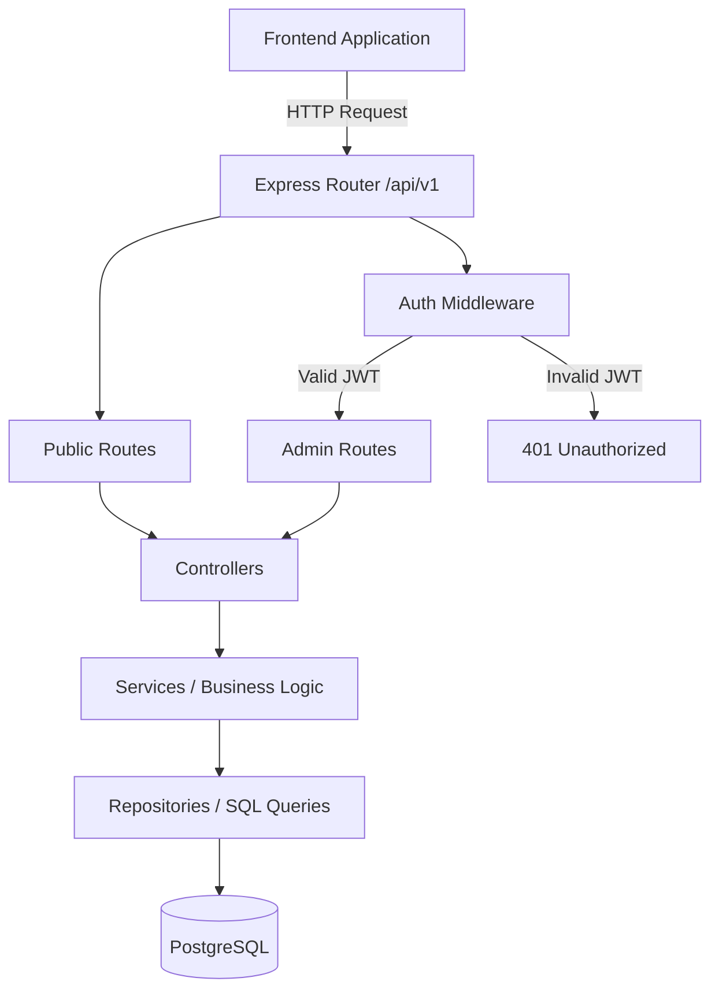

# API Overview

This document provides a high-level overview of the Website Profil Desa Cipicung API.

## Base URL
All API requests must be prefixed with the base URL and API version.
Local development: `http://localhost:3000/api/v1`

## API Version
Current Version: **v1**

## Authentication
The API utilizes stateless JSON Web Token (JWT) authentication. Tokens must be passed in the `Authorization` header as a Bearer token. See [AUTHENTICATION.md](AUTHENTICATION.md) for details.

## Public Endpoints
Public endpoints do not require authentication and are used by the public-facing website.
- `GET /api/v1/news`
- `GET /api/v1/news/:id`
- `GET /api/v1/products`
- `POST /api/v1/auth/login` (Publicly accessible to obtain tokens)

## Protected Endpoints (Admin)
Protected endpoints require a valid JWT token and are used exclusively by the Admin Dashboard.
- `POST /api/v1/admin/news`
- `PUT /api/v1/admin/news/:id`
- `DELETE /api/v1/admin/news/:id`
- `POST /api/v1/admin/products`
- `PUT /api/v1/admin/products/:id`
- `DELETE /api/v1/admin/products/:id`

## Pagination, Search, and Sorting
List endpoints (`GET /news`, `GET /products`) support query parameters for pagination, searching, and sorting.
- **Pagination**: `?page=1&limit=10`
- **Search**: `?search=keyword` (Case-insensitive)
- **Sorting**: `?sort=newest`

## Multipart Upload
Endpoints that accept file uploads (`POST /admin/news`, `PUT /admin/products/:id`) require the `Content-Type` to be `multipart/form-data`.

## JSON Response Format
The API strictly returns standardized JSON responses. See [RESPONSE_FORMAT.md](RESPONSE_FORMAT.md) for details.

## API Structure Flowchart

