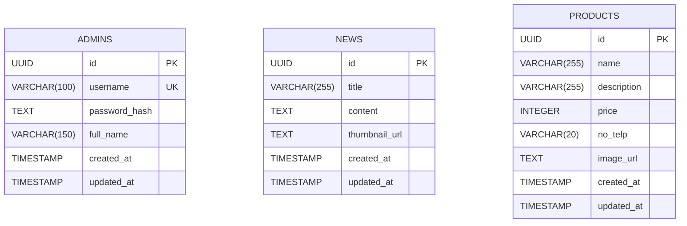

# Database Schema

This document outlines the PostgreSQL database schema used by the application. 

## Entity Relationship Diagram

*(Note: In Version 1.0, these entities operate independently without foreign key relationships).*

---

## Table: `admins`
Stores administrator credentials for the dashboard.
| Column | Type | Constraints | Description |
|--------|------|-------------|-------------|
| `id` | UUID | PRIMARY KEY | Generated automatically via `gen_random_uuid()`. |
| `username` | VARCHAR(100) | UNIQUE, NOT NULL | Must not be empty. Used for login. |
| `password_hash` | TEXT | NOT NULL | Bcrypt hashed password. Never exposed in API. |
| `full_name` | VARCHAR(150) | NOT NULL | Display name of the admin. |
| `created_at` | TIMESTAMP | NOT NULL | Default `CURRENT_TIMESTAMP`. |
| `updated_at` | TIMESTAMP | NOT NULL | Default `CURRENT_TIMESTAMP`. |

---

## Table: `news`
Stores village news articles. Maps to the News List and News Detail pages on the frontend.
| Column | Type | Constraints | Description |
|--------|------|-------------|-------------|
| `id` | UUID | PRIMARY KEY | Generated automatically via `gen_random_uuid()`. |
| `title` | VARCHAR(255) | NOT NULL | The headline of the news. |
| `content` | TEXT | NOT NULL | The body of the article. |
| `thumbnail_url` | TEXT | NULL | Relative path to the uploaded image. |
| `created_at` | TIMESTAMP | NOT NULL | Used for the `?sort=newest` query. |
| `updated_at` | TIMESTAMP | NOT NULL | Updated dynamically on PUT requests. |

**Indexes:**
- `idx_news_created_at`: Speeds up default sorting.
- `idx_news_title`: Speeds up `?search=` ILIKE queries.

---

## Table: `products`
Stores UMKM product catalog items. Maps to the Product List page.
| Column | Type | Constraints | Description |
|--------|------|-------------|-------------|
| `id` | UUID | PRIMARY KEY | Generated automatically via `gen_random_uuid()`. |
| `name` | VARCHAR(255) | NOT NULL | Name of the product. |
| `description` | VARCHAR(255) | NOT NULL | Short description. Maximum 255 chars enforced by DB constraint. |
| `price` | INTEGER | NOT NULL | Must be > 0. Stored as integer (Rupiah). |
| `no_telp` | VARCHAR(20) | NULL | WhatsApp contact number. |
| `image_url` | TEXT | NULL | Relative path to the uploaded image. |
| `created_at` | TIMESTAMP | NOT NULL | Used for the `?sort=newest` query. |
| `updated_at` | TIMESTAMP | NOT NULL | Updated dynamically on PUT requests. |

**Indexes:**
- `idx_products_created_at`: Speeds up default sorting.
- `idx_products_name`: Speeds up `?search=` ILIKE queries.
- `idx_products_price`: Speeds up sorting by price.
