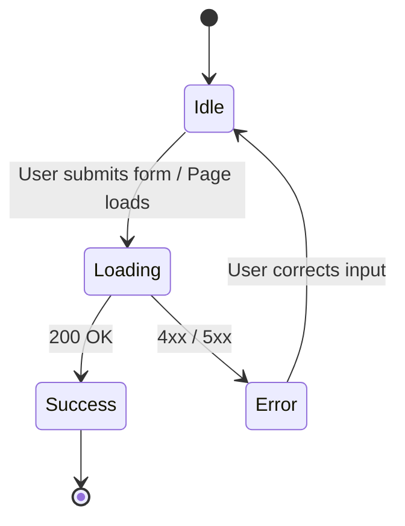

# Frontend Integration Guide

This guide explains best practices for connecting your frontend (React, Vue, Next.js, etc.) to the Desa Cipicung Backend API.

## 1. Authentication Flow
Authentication is strictly stateless using JWT.

### Login
- User enters `username` and `password`.
- Frontend sends a `POST` request to `/api/v1/auth/login`.
- If `success: true`, extract `data.accessToken`.
- **Store JWT**: Save the token in `localStorage` or memory state.
  ```javascript
  localStorage.setItem('adminToken', response.data.accessToken);
  ```

### Attaching the Authorization Header
For all protected routes (creating, updating, deleting), you must attach the token:
```javascript
const token = localStorage.getItem('adminToken');
const headers = {
    'Authorization': `Bearer ${token}`
};
```

### Logout
Simply delete the token from the frontend storage and redirect to the login page.
```javascript
localStorage.removeItem('adminToken');
window.location.href = '/login';
```

### Handling Unauthorized / Expired Tokens
If an admin token expires (after 24 hours), the backend will return a `401 Unauthorized` status on their next protected request.
- **Best Practice**: Use an Axios interceptor (or global fetch wrapper) to catch any `401` response.
- **Action**: Instantly clear `localStorage` and forcefully redirect the user to `/login`.

## 2. Image Uploads and Previews
When creating or editing News and Products, images are sent via `multipart/form-data`.

### Image Preview
Before uploading, you can show the user a preview of their selected image using `URL.createObjectURL()`:
```javascript
const handleFileChange = (event) => {
    const file = event.target.files[0];
    if (file) {
        setPreviewUrl(URL.createObjectURL(file));
    }
};
```

### Sending the Request
Use the browser's native `FormData` object.
```javascript
const formData = new FormData();
formData.append('name', productName);
formData.append('price', productPrice);
if (selectedFile) {
    formData.append('image', selectedFile);
}

// DO NOT set Content-Type header. Let the browser handle the boundary.
axios.post('/api/v1/admin/products', formData, { headers });
```

## 3. Displaying Default Images
The backend handles default images automatically. If an item has no image, the API will return the default path (e.g., `/uploads/default-product.png`) in the `image_url` field.
The frontend simply binds to the field:
```jsx

```

## 4. Pagination, Searching, and Sorting
List endpoints use query parameters. Update your frontend URL state to trigger re-fetches.
```javascript
// Example using URLSearchParams
const fetchNews = async (page = 1, search = '', sort = 'newest') => {
    const query = new URLSearchParams({ page, limit: 12, search, sort });
    const response = await fetch(`/api/v1/news?${query.toString()}`);
    // ...
}
```
Use the `pagination` object in the response to render your "Next" and "Previous" buttons based on `hasNext` and `hasPrevious`.

## 5. UI State Management
Every API integration should gracefully handle four primary states:



1. **Idle / Empty State**: Wait for user action. If fetching data and the array is empty, show a friendly "No data found" message instead of a blank screen.
2. **Loading State**: Disable submit buttons to prevent double-clicking. Show skeleton loaders or spinners while fetching lists.
3. **Error State (Network/500)**: Show a general toast notification ("Failed to connect to server").
4. **Validation Error State (422)**: Extract the `errors` array from the response and map the messages directly underneath the offending input fields.
5. **Success State**: Clear the form, close the modal, show a success toast, and trigger a re-fetch of the list.
