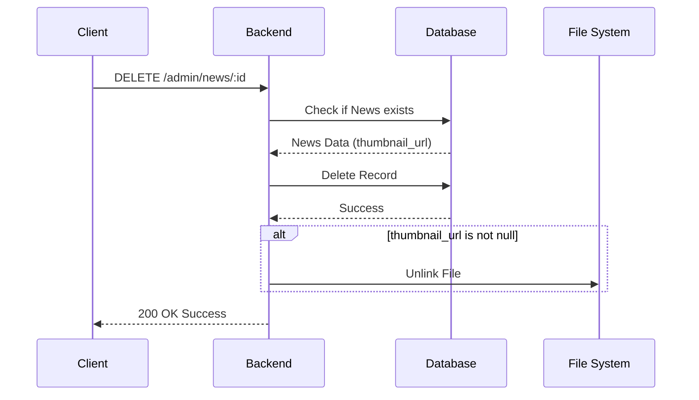

# News API

This document details all available endpoints for managing Village News.
Admin endpoints require the `SUPER_ADMIN` or `PROFILE_ADMIN` role.

## 1. Get All News (Public)

Fetches a paginated, sorted, and searchable list of news articles.

- **Method**: `GET`
- **Endpoint**: `/api/v1/news`
- **Authentication**: None required.
- **Headers**: None.
- **Body**: None.

### Query Parameters

| Parameter | Type    | Required | Default  | Description                                                       |
| --------- | ------- | -------- | -------- | ----------------------------------------------------------------- |
| `page`    | integer | No       | 1        | The page number for pagination.                                   |
| `limit`   | integer | No       | 12       | Number of items per page. (Max: 100)                              |
| `search`  | string  | No       | null     | Searches the news `title` using a case-insensitive match (ILIKE). |
| `sort`    | string  | No       | `newest` | Allowed values: `newest`, `oldest`.                               |

### Business Rules

- If an article has no uploaded image (`thumbnail_url` is null), the backend automatically replaces it with the `DEFAULT_NEWS_IMAGE` path.

### Example Request

```http
GET /api/v1/news?page=1&limit=5&search=festival&sort=title
```

### Example Response (200 OK)

```json
{
  "success": true,
  "message": "Data fetched successfully",
  "data": [
    {
      "id": "123e4567-e89b-12d3-a456-426614174000",
      "title": "Festival Desa",
      "content": "Isi berita tentang festival...",
      "thumbnail_url": "/uploads/default-news.png",
      "created_at": "2026-07-05T01:00:00.000Z",
      "updated_at": "2026-07-05T01:00:00.000Z"
    }
  ],
  "pagination": {
    "page": 1,
    "limit": 5,
    "totalItems": 1,
    "totalPages": 1,
    "hasNext": false,
    "hasPrevious": false
  }
}
```

---

## 2. Get Single News (Public)

Fetches a single news article by its unique ID.

- **Method**: `GET`
- **Endpoint**: `/api/v1/news/:id`
- **Authentication**: None required.

### Route Parameters

| Parameter | Type | Required | Description                          |
| --------- | ---- | -------- | ------------------------------------ |
| `id`      | UUID | Yes      | The unique UUID of the news article. |

### Example Response (200 OK)

```json
{
  "success": true,
  "message": "Data fetched successfully",
  "data": {
    "id": "123e4567-e89b-12d3-a456-426614174000",
    "title": "Festival Desa",
    "content": "Isi berita...",
    "thumbnail_url": "/uploads/news/filename.jpg",
    "created_at": "...",
    "updated_at": "..."
  }
}
```

**Errors:** Returns `404 Not Found` if the ID does not exist.

---

## 3. Create News (Protected)

Creates a new news article.

- **Method**: `POST`
- **Endpoint**: `/api/v1/admin/news`
- **Authentication**: Required (Bearer Token).
- **Authorization**: `SUPER_ADMIN` or `PROFILE_ADMIN`.
- **Headers**: `Content-Type: multipart/form-data`

### Request Body (Form Data)

| Field       | Type | Required | Rules                                           |
| ----------- | ---- | -------- | ----------------------------------------------- |
| `title`     | text | Yes      | Max 255 characters. Cannot be empty.            |
| `content`   | text | Yes      | Cannot be empty.                                |
| `thumbnail` | file | No       | Max 5MB. Allowed: `jpg`, `jpeg`, `png`, `webp`. |

### Business Rules

- If `thumbnail` is omitted, `thumbnail_url` is stored as `null` in the database.
- Uploaded files are saved in `/uploads/news/`.

### Example Response (201 Created)

```json
{
    "success": true,
    "message": "Data created successfully",
    "data": { ...news object }
}
```

---

## 4. Update News (Protected)

Updates an existing news article.

- **Method**: `PUT`
- **Endpoint**: `/api/v1/admin/news/:id`
- **Authentication**: Required (Bearer Token).
- **Authorization**: `SUPER_ADMIN` or `PROFILE_ADMIN`.
- **Headers**: `Content-Type: multipart/form-data`

### Request Body (Form Data)

All fields are optional, but **at least one field** must be provided.
| Field | Type | Rules |
|-------|------|-------|
| `title` | text | Max 255 characters. |
| `content` | text | Cannot be empty if provided. |
| `thumbnail` | file | Max 5MB. Replaces old image. |

### Business Rules

- Automatically updates `updated_at` to the current timestamp.
- **Image Replacement**: If a new `thumbnail` is uploaded and the news already has a custom image, the old image is safely deleted from the filesystem.

---

## 5. Delete News (Protected)

Deletes a news article and its associated image.

- **Method**: `DELETE`
- **Endpoint**: `/api/v1/admin/news/:id`
- **Authentication**: Required (Bearer Token).
- **Authorization**: `SUPER_ADMIN` or `PROFILE_ADMIN`.

### Business Rules

- The database record is deleted.
- **Image Deletion**: If the news had a custom uploaded image, the physical file is deleted from `/uploads/news/`. The default placeholder image is never deleted.

### Example Response (200 OK)

```json
{
  "success": true,
  "message": "Data deleted successfully"
}
```

### Image Deletion Sequence Flow


